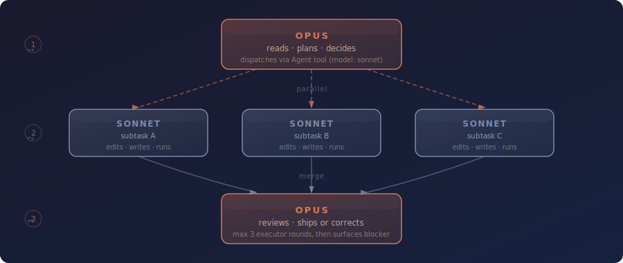

<div align="center">



[](https://github.com/zabrodsk/claude-advisor-plugin/blob/main/LICENSE)
[](https://github.com/zabrodsk/claude-advisor-plugin/releases)
[](https://github.com/zabrodsk/claude-advisor-plugin)
[](https://github.com/zabrodsk/claude-advisor-plugin)
[](https://github.com/zabrodsk/claude-advisor-plugin)
[](https://github.com/zabrodsk/claude-advisor-plugin)

</div>

Claude Opus is the smartest model Anthropic ships. It's also the most expensive. The Advisor Strategy lets you pay for Opus reasoning **once** and get parallel Sonnet execution for everything else. Same decisions. Roughly a third of the tokens.

---

## Cost savings, in practice

<div align="center">



*Approximate, directional comparison for a typical session — not a measured benchmark.*

</div>

---

## Install

Inside Claude Code, run these **two commands separately** — send the first, wait for it to succeed, then send the second:

**1. Add the marketplace:**

```
/plugin marketplace add https://github.com/zabrodsk/claude-advisor-plugin.git
```

**2. Install the plugin:**

```
/plugin install advisor@claude-advisor-plugin
```

> Pasting both lines in one prompt will concatenate the second command onto the clone URL and fail. Send each line on its own.

## Usage

```
/claude-advisor-plugin:advisor
```

Or say **"advisor mode"**, **"use advisor"**, or **"advisor strategy"** — the skill auto-triggers.

---

## How it works

<div align="center">



</div>

Opus dispatches executors via the `Agent` tool with `model: "sonnet"`. If three rounds haven't resolved the task, Opus surfaces the blocker rather than burning more tokens.

| Without advisor | With advisor |
|---|---|
| Opus writes every file edit | Sonnet writes; Opus reviews |
| Sequential execution | Parallel Sonnet subagents |
| Opus tokens for boilerplate | Opus tokens for reasoning only |
| No spend cap | Hard cap: 3 executor rounds |

---

## Why you want this

- **Opus decisions, Sonnet bills.** Deep reasoning where it matters, fast implementation where it doesn't.
- **Parallel by default.** Independent subtasks run simultaneously, not one after another.
- **Hard cap on spend.** Three executor rounds maximum — no silent runaway costs.
- **One command to activate.** Drop-in for any session, works alongside any other plugin or workflow.

---

Inspired by Anthropic's [Advisor Strategy](https://claude.com/blog/the-advisor-strategy) — the same cost/quality tradeoff as the `advisor_20260301` API tool, implemented at the orchestration layer.

---

<div align="center">

MIT — Copyright &copy; 2026 Dusan Zabrodsky

</div>
